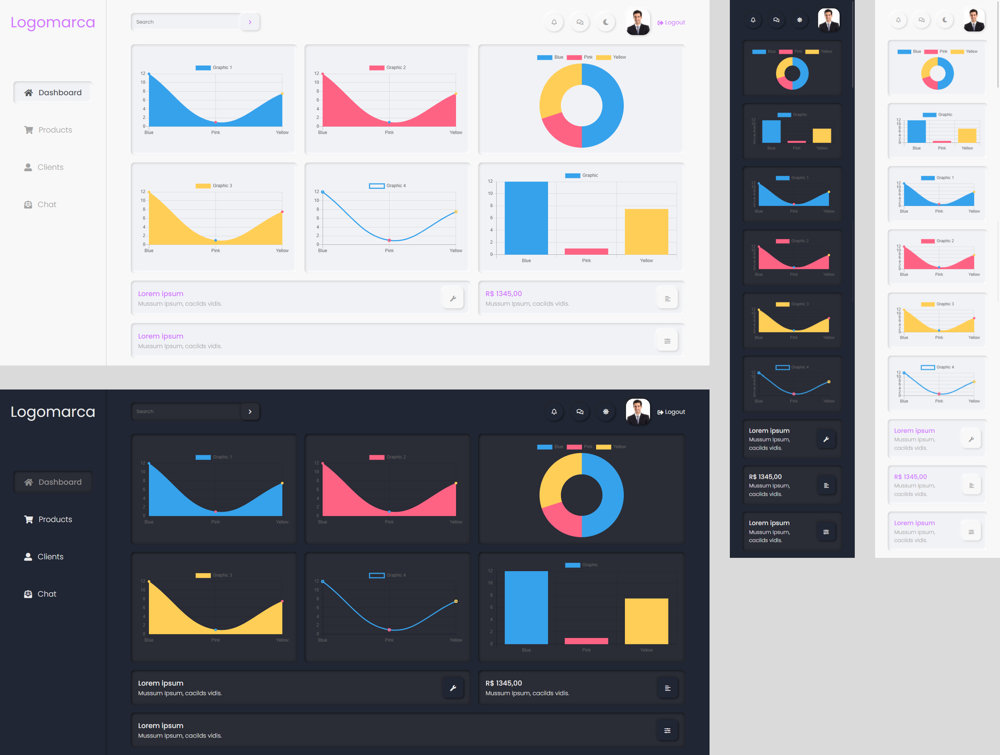

<h3 align="center">Criado por<a href="https://github.com/LipzDev"> Filipe Gomes</a></h3>
  
  

     Dashboard com neumorfismo.
        
     
    <a href="https://github.com/LipzDev/Desafio-Dashboard">Desafio</a>
    ·
    <a href="https://www.devchallenge.com.br/">DevChallenge</a>
  

## Índice

* [Devchallenge](#devchallenge) 
* [Desafio](#desafio)
* [Tecnologias](#tecnologias)
* [Dicas](#dicas)    
  * [Biblioteca](#biblioteca)
  * [Cores](#cores)  
  * [Icones](#icones)
  * [Tipo de fonte](#fonte)
  * [Layout](#layout)
* [Compartilhe](#compartilhe)

# Devchallenge:
<a href="https://devchallenge.now.sh/"> DevChallenge</a> permite que você evolua suas skills como programador! Participe da nossa <a href="https://discord.gg/yvYXhGj">comunidade</a> o/

# Desafio:
Seu desafio é criar uma tela de Dashboard com neumorfismo e modo noturno! O modelo final está disponível na pasta "design". 
Aqui segue o [Link para demonstração do projeto](https://lipzdev.github.io/Dashboard/#), o responsivo ainda esta precisando de alguns ajustes!

## Requisitos
- A pagina precisa ter os gráficos que serão disponibilizados através da biblioteca Chart.js e faz parte do seu desafio descobrir como utilizar esta linda biblioteca! 
- A página precisa ser feita com o uso de flexbox ou css grid layout 
- A página precisa ter a versão dark theme 

# Tecnologias:
- HTML
- CSS
- SASS (Opcional)
- JAVASCRIPT (Básico)

# Biblioteca:

Documentação Chart.Js (Biblioteca de gráficos): <a href="https://www.chartjs.org/docs/latest/charts/doughnut.html">Chart.Js</a>

# Dicas:

## Cores

Light theme:
- #D478FF
- #a3a3a3
- #53565a
- #f8f8f8
- #F1F2F6
- #ccc
- #ffffff

Dark theme:
- #e9e9e9
- #8d8d8d
- #000000
- #24252b
- #2a2c36
- #202633

## Icones
Para os ícones, recomendamos que utilize alguma biblioteca, como o Font Awesome

## Fonte
- Poppins

## Layout
O modelo final desktop e mobile está disponível na pasta `./design` 

    

# Compartilhe:
Inicie seu projeto utilizando esse template no seu github como um repositório público 
Faça um print, gif ou vídeo e compartilhe o resultado com a #devchallenge ou marcando nosso perfil @devchallenge! 

Desafio criado por  <a href="https://www.linkedin.com/in/LipzDev">Filipe Gomes</a> :)

# Comunidade DevChallenge:
Site: https://www.devchallenge.com.br/  
Discord: https://discord.gg/yvYXhGj  
Linkedin: https://www.linkedin.com/company/devchallenge/ 
Twitter: https://twitter.com/dev_challenge 
Instagram: https://www.instagram.com/devchallenge/ 
